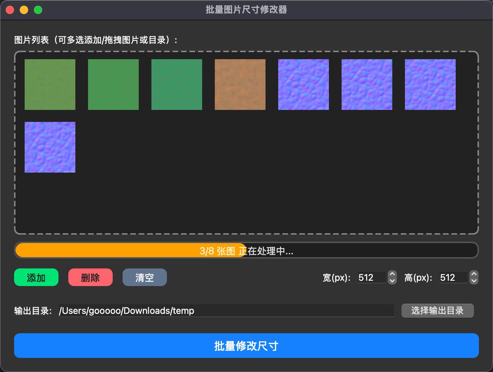

# 批量图片尺寸修改器

一个基于 PyQt5 的简洁易用的批量图片尺寸修改工具，支持拖拽、批量处理、输出目录自定义，适用于 macOS。

---

## 预览



---

## 功能特色

- 支持批量添加图片或文件夹，自动识别图片格式
- 拖拽图片/文件夹到窗口即可添加
- 支持 PNG、JPG、JPEG、BMP、GIF、WEBP 等常见格式
- 可自定义输出目录、图片宽高
- 操作简单，界面美观

---

## 使用方法

1. 安装依赖（首次使用）：

   ```bash
   pip install PyQt5 Pillow
   ```

2. 运行程序：

   ```bash
   python batch_image_resizer.py
   ```

3. 拖拽图片或文件夹到窗口，设置输出目录和目标尺寸，点击“批量修改尺寸”即可。

---

## 打包为 macOS 应用

如需打包为 macOS 原生 app（推荐 PyInstaller）：

```bash
python3 -m PyInstaller --windowed --name "批量图片尺寸修改器" --icon=icon_batch_chg_imgsize.icns --clean --noconfirm batch_image_resizer.py
```

打包后，`dist/批量图片尺寸修改器.app` 即为可直接运行的 macOS 应用。

---

## Mac 版直接下载

无需 Python 环境，直接下载解压即可用：

[点此下载 Mac 版批量图片尺寸修改器](realease/mac/batch_image_resizer.zip)

---

## 开源协议

MIT License

--- 